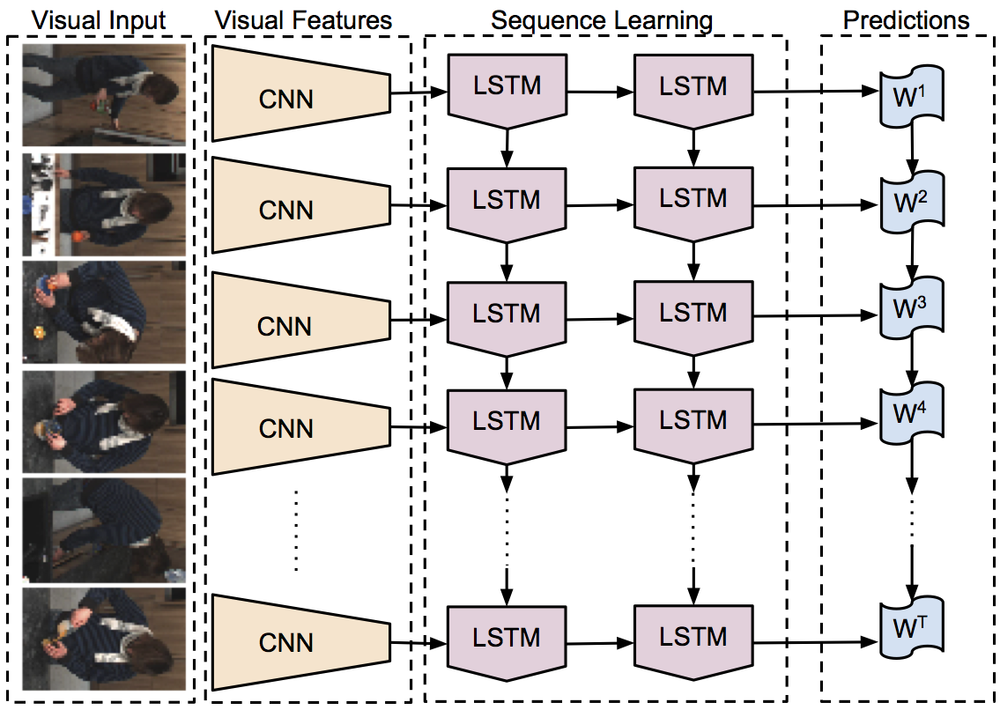

# predict-car-speed

# Learn and Predict Vehicle Speed From A Video


**This is a project report for the comma.ai programming challenge.**

Basically, the goal is to predict the speed of a car from a video.

```
Welcome to the comma.ai 2017 Programming Challenge!

Basically, your goal is to predict the speed of a car from a video.

data/train.mp4 is a video of driving containing 20400 frames. Video is shot at 20 fps.
data/train.txt contains the speed of the car at each frame, one speed on each line.

data/test.mp4 is a different driving video containing 10798 frames.
Video is shot at 20 fps.
Your deliverable is test.txt

We will evaluate your test.txt using mean squared error.
<10 is good. <5 is better. <3 is heart.
```

## Dataset Exploration

train.mp4 17:00 640*480
train.txt 20400 lines label!

### Train Dataset

The training dataset is about 17 minutes in total, which contains 20400 frames.
Two types of scenes seem to appear:

* **0:00 - 12:30**: highway (12 min 30 sec)
* **12:31 - 17:00**: street (4 min 30 sec)


The labels (speed), accordingly, have less-diverse and higher speeds in the highway in the first half and more diverse and slower speeds in the street.


### Test Dataset

Test data is total of 9 minutes. It has three types of scenes:

* **0:00 - 1:30**: street but the ones that do not appear on the training data (1 min 30 sec)
* **1:30 - 4:30**: highway (3 min)
* **4:30 - 9:00**: street that is similar to the one that appears in the training data. (4 min 30 sec)

The test dataset definitely has more varied scenes including the ones that do not appear in the training dataset. For example, some do not have clear lanes. We'll have to be careful not to over-fit to the training dataset.


## Preprocessing


### Sliding Window

A dataset with 20400 frames is a small one to train on. So I want to use every possible samples.
I used split ratio of 90%. So out of 20400 frames, 90% (18360 Frames) are used for training and 10% (2040 Frames) are used for the validation.

I used sliding window with different shifting values to create several variations of datasets. They have same number of samples but those samples are slightly shifted in time. This was because I had ensemble approach in mind. I wanted to feed models slightly different dataset to produce varying opinions. Averaging them might give a better prediction.


## Models

### AlexLSTM (2D CNN + LSTM)




```
[!] Model Summary:
AlexLSTM (
  (conv): Sequential (
    (0): Sequential (
      (0): Conv2d(3, 64, kernel_size=(11, 11), stride=(4, 4), padding=(2, 2))
      (1): ReLU (inplace)
      (2): MaxPool2d (size=(3, 3), stride=(2, 2), dilation=(1, 1))
      (3): Conv2d(64, 192, kernel_size=(5, 5), stride=(1, 1), padding=(2, 2))
      (4): ReLU (inplace)
      (5): MaxPool2d (size=(3, 3), stride=(2, 2), dilation=(1, 1))
      (6): Conv2d(192, 384, kernel_size=(3, 3), stride=(1, 1), padding=(1, 1))
      (7): ReLU (inplace)
      (8): Conv2d(384, 256, kernel_size=(3, 3), stride=(1, 1), padding=(1, 1))
      (9): ReLU (inplace)
      (10): Conv2d(256, 256, kernel_size=(3, 3), stride=(1, 1), padding=(1, 1))
      (11): ReLU (inplace)
      (12): MaxPool2d (size=(3, 3), stride=(2, 2), dilation=(1, 1))
    )
  )
  (lstm): LSTM(1280, 256, num_layers=2, dropout=0.2)
  (fc): Sequential (
    (0): Linear (256 -> 64)
    (1): ReLU ()
    (2): Dropout (p = 0.2)
    (3): Linear (64 -> 1)
  )
)
```
## Result

https://github.com/keon/speed/blob/master/predictions.txt

## Future Work

I believe there is a lot of room for improvements. I wish I could:

- Tune the hyperparameters
- Explore deeper and wider models
- Use reinforcement learning
- Also predict steering and test it on GTA or other racing games.
- Explore more on preventing overfitting

## References

* [Deep Recurrent Q-Learning for Partially Observable MDPs](https://arxiv.org/abs/1507.06527)
* [Learning Spatiotemporal Features with 3D Convolutional Networks](https://arxiv.org/abs/1412.0767)
* [End to End Learning for Self-Driving Cars - Bojarski et al.](https://arxiv.org/abs/1604.07316)
* [Large-scale Video Classification with Convolutional Neural Network - Karpathy et al.](https://static.googleusercontent.com/media/research.google.com/en//pubs/archive/42455.pdf)
* [Playing Atari with Deep Reinforcement Learning](https://arxiv.org/abs/1312.5602)
* [An augmentation based deep neural network approach to learn human driving behavior](https://chatbotslife.com/using-augmentation-to-mimic-human-driving-496b569760a9)
