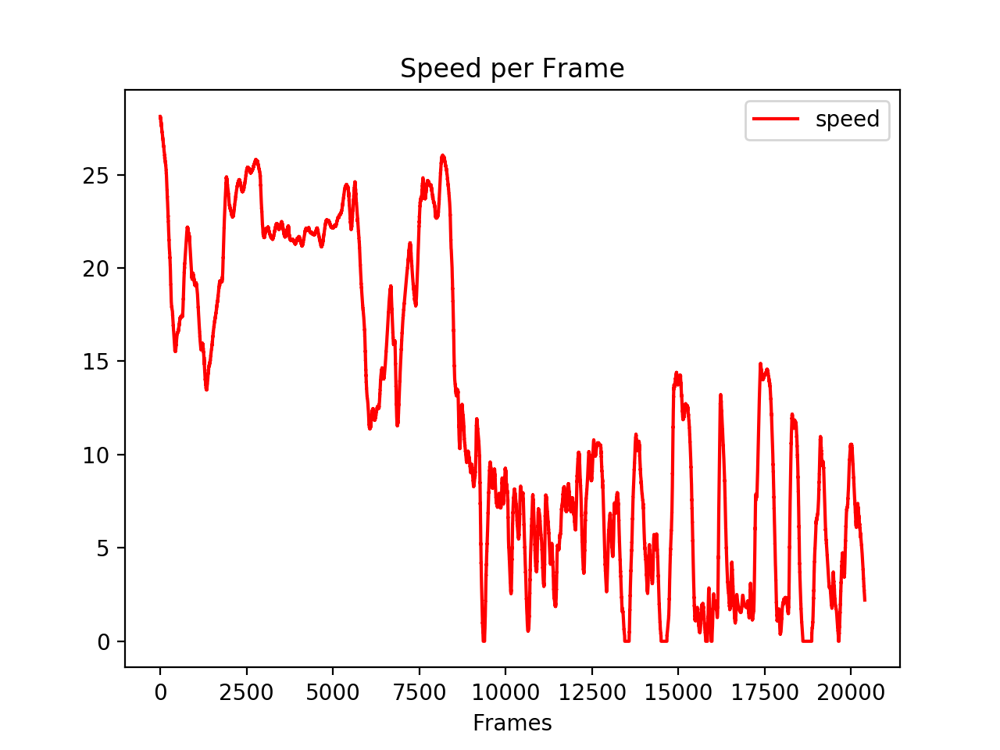

## Learn and Predict Vehicle Speed From A Video


## What Is The Question
Given a 17:00 minutes video (20 fps), there's one label per frame which tells the vehicle velocity <br />
Given a 9:00 minutes video (20 fps), inference the vehicle velocity for each frame

## Dataset Exploration
data/train.mp4 is a video of driving containing 20400 frames. Video is shot at 20 fps. <br />
data/train.txt contains the speed of the car at each frame, one speed on each line. <br />

data/test.mp4 is a different driving video containing 10798 frames. Video is shot at 20 fps. <br />
Your deliverable is test.txt <br />

## Train Dataset
* **0:00 - 12:30**: highway (12 min 30 sec)
* **12:31 - 17:00**: street (4 min 30 sec)


## AlexLSTM (2D CNN + LSTM)

```
[!] Model Summary:
AlexLSTM (
  (conv): Sequential (
    (0): Sequential (
      (0): Conv2d(3, 64, kernel_size=(11, 11), stride=(4, 4), padding=(2, 2))
      (1): ReLU (inplace)
      (2): MaxPool2d (size=(3, 3), stride=(2, 2), dilation=(1, 1))
      (3): Conv2d(64, 192, kernel_size=(5, 5), stride=(1, 1), padding=(2, 2))
      (4): ReLU (inplace)
      (5): MaxPool2d (size=(3, 3), stride=(2, 2), dilation=(1, 1))
      (6): Conv2d(192, 384, kernel_size=(3, 3), stride=(1, 1), padding=(1, 1))
      (7): ReLU (inplace)
      (8): Conv2d(384, 256, kernel_size=(3, 3), stride=(1, 1), padding=(1, 1))
      (9): ReLU (inplace)
      (10): Conv2d(256, 256, kernel_size=(3, 3), stride=(1, 1), padding=(1, 1))
      (11): ReLU (inplace)
      (12): MaxPool2d (size=(3, 3), stride=(2, 2), dilation=(1, 1))
    )
  )
  (lstm): LSTM(12288, 1600, num_layers=3, dropout=0.3)
  (fc): Sequential (
    (0): Linear (1600 -> 512)
    (1): ReLU ()
    (2): Dropout (p = 0.2)
    (3): Linear (512 -> 64)
    (4): ReLU ()
    (5): Dropout (p = 0.2)
    (6): Linear (64 -> 1)
  )
)
```
The dimension between each layer
```
(batch_size, 20, hh, ww, 3) -> AlexNet -> (batch_size, 20, hh', ww', filter_size) -> flatten -> (batch_size, 20, 12288)

(batch_size, 20, 12288) -> LSTM -> (batch_size, 19, 1600)  # 20 images input per batch, get last 19 unit([1:]) output from LSTM

(batch_size, 19, 1600) -> fc_layer_1 -> (batch_size, 19, 512) -> fc_layer_2 -> (batch_size, 19, 64) -> fc_layer_3 -> (batch_size, 19, 1) 
```
## Result
https://github.com/kingxueyuf/predict-car-speed/blob/master/test.txt
